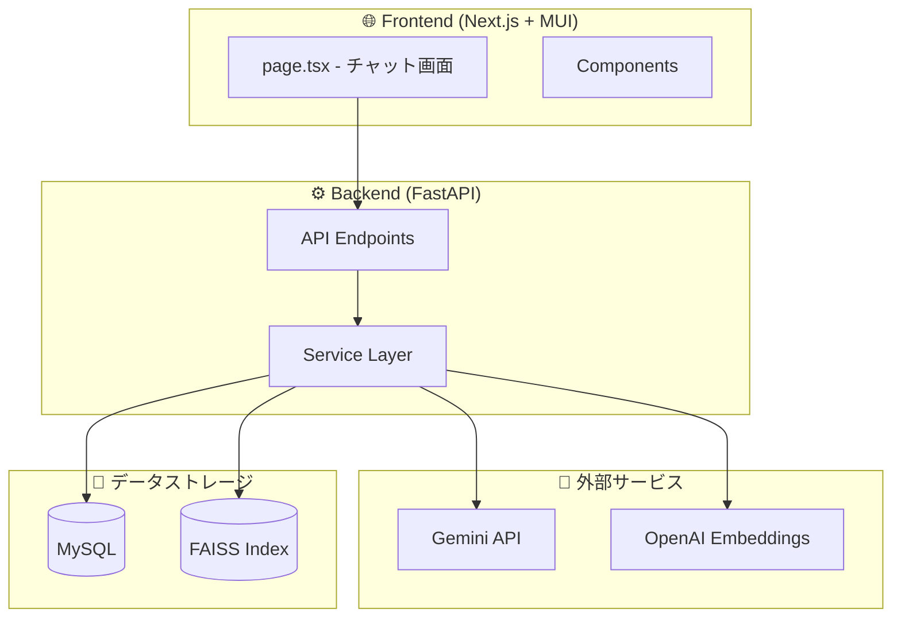
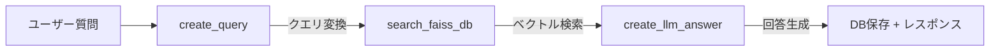
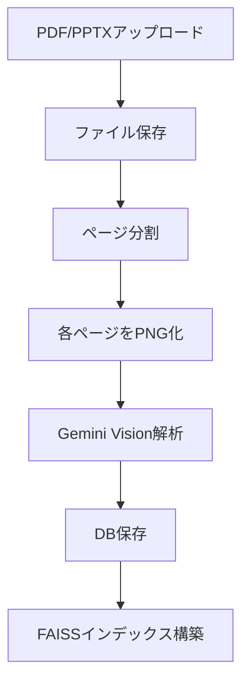
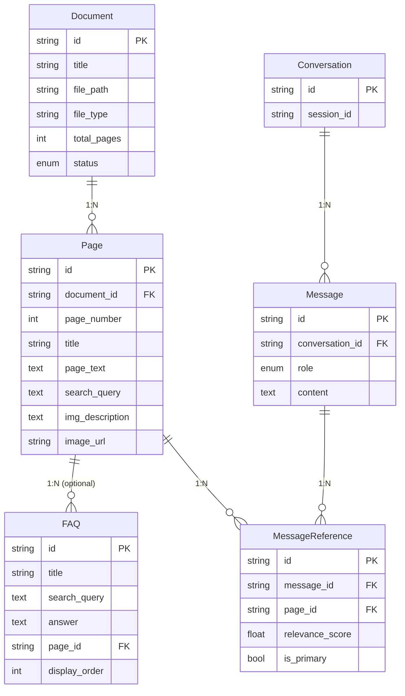

# tenant-ai-assistant-mvp コードリーディングガイド

プロジェクトを**5つの主要機能**に分類しました。各機能ごとに追うべきファイルと順序を示します。

---

## 📊 アーキテクチャ概要

---

## 🎯 機能1: チャット / RAG機能

**概要**: ユーザーの質問に対してベクトル検索 + LLMで回答を生成する中核機能

### 追うべきファイル（順序）

| 順序 | ファイル | 役割 |
|:---:|----------|------|
| 1️⃣ | [page.tsx](file:///Users/t/Projects/RAG/tenant-ai-assistant-mvp/frontend/app/page.tsx) | チャットUI、状態管理、API呼び出し |
| 2️⃣ | [ChatInput.tsx](file:///Users/t/Projects/RAG/tenant-ai-assistant-mvp/frontend/components/ChatInput.tsx) | テキスト入力コンポーネント |
| 3️⃣ | [api.ts](file:///Users/t/Projects/RAG/tenant-ai-assistant-mvp/frontend/lib/api.ts) | APIクライアント |
| 4️⃣ | [chat.py (endpoint)](file:///Users/t/Projects/RAG/tenant-ai-assistant-mvp/backend/app/api/v1/endpoints/chat.py) | APIエンドポイント |
| 5️⃣ | [chat_service.py](file:///Users/t/Projects/RAG/tenant-ai-assistant-mvp/backend/app/services/chat_service.py) | **ビジネスロジック統括** |
| 6️⃣ | [faiss_service.py](file:///Users/t/Projects/RAG/tenant-ai-assistant-mvp/backend/app/services/faiss_service.py) | ベクトル検索実行 |
| 7️⃣ | [gemini_service.py](file:///Users/t/Projects/RAG/tenant-ai-assistant-mvp/backend/app/services/gemini_service.py) | LLM呼び出し |

### 主要な処理フロー

### 注目すべきポイント
- `chat_service.py` の `handle_chat()` が全体を統括
- `create_query()`: 自然言語 → 検索キーワード変換（Gemini使用）
- `search_faiss_db()`: Chunk検索 + FAQ検索を同時実行
- `create_llm_answer()`: 検索結果を参照資料としてLLM回答生成

---

## 📄 機能2: ドキュメント処理

**概要**: PDF/PPTXをアップロード → ページ分割 → OCR/画像解析 → インデックス登録

### 追うべきファイル（順序）

| 順序 | ファイル | 役割 |
|:---:|----------|------|
| 1️⃣ | [documents.py (endpoint)](file:///Users/t/Projects/RAG/tenant-ai-assistant-mvp/backend/app/api/v1/endpoints/documents.py) | アップロードAPI |
| 2️⃣ | [document_processor.py](file:///Users/t/Projects/RAG/tenant-ai-assistant-mvp/backend/app/services/document_processor.py) | **PDF処理の本体** |
| 3️⃣ | [gemini_service.py](file:///Users/t/Projects/RAG/tenant-ai-assistant-mvp/backend/app/services/gemini_service.py) | OCR/画像解析（Gemini Vision） |
| 4️⃣ | [indexer.py](file:///Users/t/Projects/RAG/tenant-ai-assistant-mvp/backend/app/services/indexer.py) | FAISSインデックス再構築 |

### 主要な処理フロー

### 注目すべきポイント
- `process_uploaded_document_with_progress()`: SSEでプログレスをストリーミング
- `_extract_page_with_gemini()`: 各ページの構造化抽出（タイトル、本文、図表説明等）
- PPTX → PDF変換はLibreOffice（soffice）を使用

---

## 🗃️ 機能3: ベクトル検索インデックス

**概要**: OpenAI EmbeddingsでテキストをベクトルにしてFAISSで類似検索

### 追うべきファイル（順序）

| 順序 | ファイル | 役割 |
|:---:|----------|------|
| 1️⃣ | [faiss_service.py](file:///Users/t/Projects/RAG/tenant-ai-assistant-mvp/backend/app/services/faiss_service.py) | FAISS操作のユーティリティ |
| 2️⃣ | [indexer.py](file:///Users/t/Projects/RAG/tenant-ai-assistant-mvp/backend/app/services/indexer.py) | インデックス再構築ロジック |

### インデックスの種類

| インデックス | 格納データ | 用途 |
|-------------|-----------|------|
| `chunk_faiss` | ページ情報（search_query + メタデータ） | メイン検索 |
| `faq_faiss` | FAQ情報（search_query + 回答） | FAQ類似検索 |

### 注目すべきポイント
- LangChainの `FAISS` クラスを利用
- `similarity_search_with_score()`: 距離付きで検索結果を返す
- `build_index_from_texts()`: テキスト + メタデータからインデックス構築

---

## ❓ 機能4: FAQ管理

**概要**: よくある質問を管理し、ベクトル検索可能にする

### 追うべきファイル（順序）

| 順序 | ファイル | 役割 |
|:---:|----------|------|
| 1️⃣ | [faqs.py (endpoint)](file:///Users/t/Projects/RAG/tenant-ai-assistant-mvp/backend/app/api/v1/endpoints/faqs.py) | CRUD API |
| 2️⃣ | [faqs.py (schema)](file:///Users/t/Projects/RAG/tenant-ai-assistant-mvp/backend/app/schemas/faqs.py) | リクエスト/レスポンス型定義 |
| 3️⃣ | [entities.py](file:///Users/t/Projects/RAG/tenant-ai-assistant-mvp/backend/app/models/entities.py) | FAQエンティティ定義 |
| 4️⃣ | [indexer.py](file:///Users/t/Projects/RAG/tenant-ai-assistant-mvp/backend/app/services/indexer.py) | FAQ変更時のインデックス再構築 |

### 注目すべきポイント
- FAQの作成/更新/削除時に自動でFAISSインデックスを再構築
- `page_id` でページと紐付け可能（参照ページを表示できる）

---

## 🖥️ 機能5: フロントエンドUI

**概要**: Next.js + MUI でチャットUIを構築

### 追うべきファイル（順序）

| 順序 | ファイル | 役割 |
|:---:|----------|------|
| 1️⃣ | [page.tsx](file:///Users/t/Projects/RAG/tenant-ai-assistant-mvp/frontend/app/page.tsx) | メインチャット画面 |
| 2️⃣ | [ChatInput.tsx](file:///Users/t/Projects/RAG/tenant-ai-assistant-mvp/frontend/components/ChatInput.tsx) | 入力フォーム |
| 3️⃣ | [ChatMessageList.tsx](file:///Users/t/Projects/RAG/tenant-ai-assistant-mvp/frontend/components/ChatMessageList.tsx) | メッセージ一覧表示 |
| 4️⃣ | [ReferenceModal.tsx](file:///Users/t/Projects/RAG/tenant-ai-assistant-mvp/frontend/components/ReferenceModal.tsx) | 参照ページのモーダル表示 |
| 5️⃣ | [FAQList.tsx](file:///Users/t/Projects/RAG/tenant-ai-assistant-mvp/frontend/components/FAQList.tsx) | FAQ一覧表示 |
| 6️⃣ | [api.ts](file:///Users/t/Projects/RAG/tenant-ai-assistant-mvp/frontend/lib/api.ts) | APIクライアント |
| 7️⃣ | [types.ts](file:///Users/t/Projects/RAG/tenant-ai-assistant-mvp/frontend/lib/types.ts) | 型定義 |

---

## 📦 データモデル

[entities.py](file:///Users/t/Projects/RAG/tenant-ai-assistant-mvp/backend/app/models/entities.py) に定義されているエンティティ:

---

## 🚀 推奨コードリーディング順序

| 優先度 | 機能 | 理由 |
|:-----:|------|------|
| 1️⃣ | **チャット/RAG** | 中核機能、全体の流れを理解できる |
| 2️⃣ | **ドキュメント処理** | データがどうやって入るかを理解 |
| 3️⃣ | **データモデル** | entities.pyでDB構造を把握 |
| 4️⃣ | **ベクトル検索** | 検索の仕組みを深掘り |
| 5️⃣ | **FAQ管理** | シンプルなCRUDパターン |
| 6️⃣ | **フロントエンド** | UI実装の詳細 |

---

## 📚 既存の解析ドキュメント

docsディレクトリに詳細な解析ドキュメントがあります:

| ファイル | 内容 |
|---------|------|
| [flow_1.md](file:///Users/t/Projects/RAG/tenant-ai-assistant-mvp/docs/flow_1.md) | チャット送信機能の詳細フロー（シーケンス図含む） |
| [step_1.md](file:///Users/t/Projects/RAG/tenant-ai-assistant-mvp/docs/step_1.md) | PDF処理Step1の解析 |
| [step_2.md](file:///Users/t/Projects/RAG/tenant-ai-assistant-mvp/docs/step_2.md) | PDF処理Step2の解析 |
| [step_3_query.md](file:///Users/t/Projects/RAG/tenant-ai-assistant-mvp/docs/step_3_query.md) | クエリ変換の詳細解析 |
