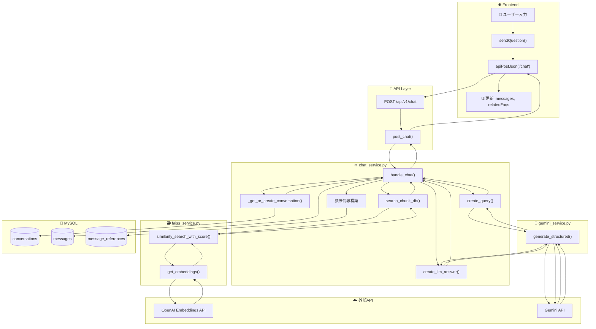
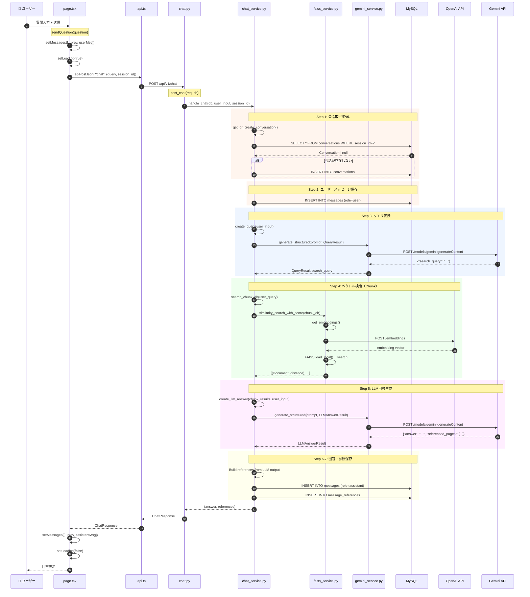
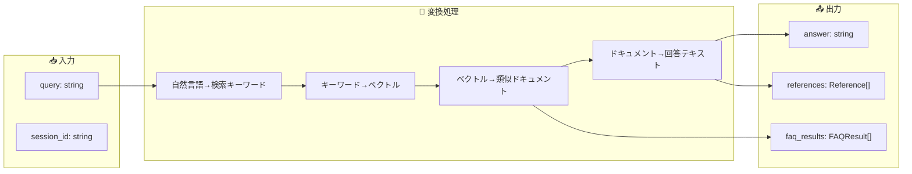
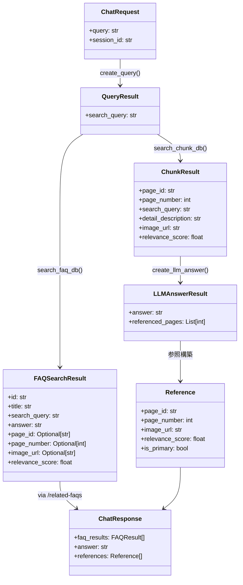
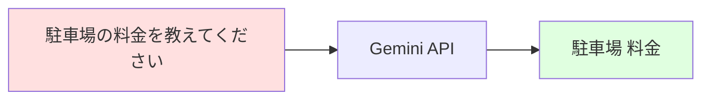
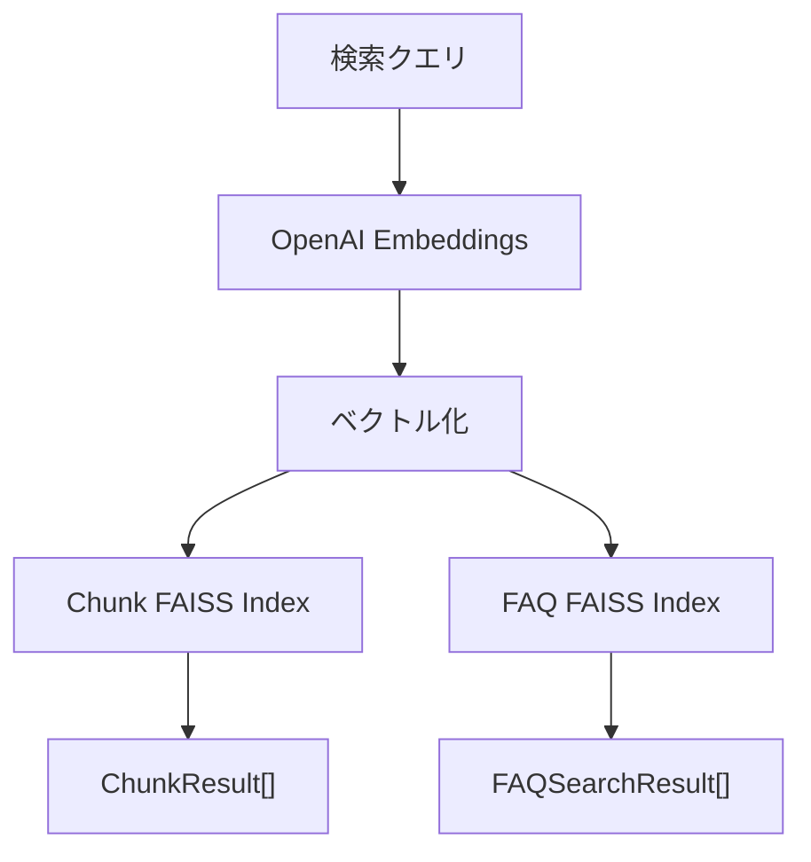
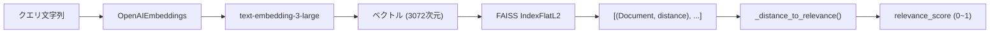

# 機能1: チャット/RAG機能 - 詳細コード解析

## 📋 概要

ユーザーの質問に対して**ベクトル検索 + LLM**で回答を生成する中核機能。  
以下の順序でデータと関数が呼び出される。

---

## 🔄 全体フロー図



---

## 📊 関数呼び出しシーケンス図



**補足**: FAQ検索は別エンドポイント `/chat/related-faqs` で並列実行され、フロントエンドで結果をマージして表示

---

## 📦 データフロー詳細

### 入力 → 出力の変換



### 各ステップのデータ形式

| Step | 関数 | 入力 | 出力 |
|:----:|------|------|------|
| 1 | `_get_or_create_conversation()` | `session_id: str` | `Conversation` |
| 2 | DB INSERT | `Message(role=user)` | - |
| 3 | `create_query()` | `user_input: str` | `search_query: str` |
| 4 | `search_chunk_db()` | `user_query: str` | `ChunkResult[]` |
| 5 | `create_llm_answer()` | `ChunkResult[], user_input` | `LLMAnswerResult` |
| 6-7 | DB INSERT | `Message, MessageReference` | - |

---

## 🏗️ 主要クラス/型定義



---

## 🔍 関数詳細

### 1. `handle_chat()` - メインエントリポイント

```python
# ファイル: chat_service.py:174-237
async def handle_chat(db, *, user_input, session_id):
    # Step 1: 会話取得/作成
    conv = await _get_or_create_conversation(db, session_id)

    # Step 2: ユーザーメッセージ保存
    user_msg = Message(...)
    db.add(user_msg)

    # Step 3: クエリ変換
    user_query = await create_query(user_input)

    # Step 4: ベクトル検索（チャンクのみ）
    chunk_results = await search_chunk_db(user_query)

    # Step 5: LLM回答生成
    llm = await create_llm_answer(chunk_results, user_input)

    # Step 6-7: 参照構築 & 保存
    references = [...]  # LLMが選んだページ番号をマッチング
    assistant_msg = Message(...)
    db.add(assistant_msg)
    # message_references も保存

    return llm.answer, references
```

### 2. `create_query()` - クエリ変換



**プロンプト構造**:
- 入力: ユーザーの自然言語質問
- 指示: 短いキーワード/フレーズに変換
- 出力: `QueryResult { search_query: str }`

### 3. `search_chunk_db()` / `search_faq_db()` - ベクトル検索



**検索パラメータ**:
- `search_chunk_db()`: `k=5` (上位5件) - `/chat` エンドポイントで使用
- `search_faq_db()`: `k=3` (上位3件) - `/chat/related-faqs` エンドポイントで使用

**注意**: チャット回答生成とFAQ検索は別々のエンドポイントで実行される

### 4. `create_llm_answer()` - 回答生成

**コンテキスト構築**:
```
【ページ1】
詳細説明テキスト...

【ページ3】
詳細説明テキスト...
```

**出力形式**:
```json
{
  "answer": "回答テキスト",
  "referenced_pages": [1, 3]
}
```

### 5. `similarity_search_with_score()` - FAISS検索



**距離 → 関連度変換**:
```python
def _distance_to_relevance(distance):
    return 1.0 / (1.0 + distance)
```

---

## 💾 DB操作タイムライン

```mermaid
gantt
    title DB操作タイミング
    dateFormat X
    axisFormat %s
    
    section 読み取り
    SELECT conversations    :0, 1
    
    section 書き込み
    INSERT conversations (必要時) :1, 2
    INSERT messages (user)        :2, 3
    INSERT messages (assistant)   :6, 7
    INSERT message_references     :7, 8
    
    section 外部API
    Gemini (create_query)         :3, 4
    OpenAI Embeddings             :4, 5
    Gemini (create_llm_answer)    :5, 6
```



---

## 📁 ファイル対応表

| ファイル | 主要関数 | 責務 |
|---------|---------|------|
| [page.tsx](file:///Users/t/Projects/RAG/tenant-ai-assistant-mvp/frontend/app/page.tsx#L61-127) | `sendQuestion()` | UI状態管理、API呼び出し |
| [api.ts](file:///Users/t/Projects/RAG/tenant-ai-assistant-mvp/frontend/lib/api.ts#L19-33) | `apiPostJson()` | HTTPリクエスト |
| [chat.py](file:///Users/t/Projects/RAG/tenant-ai-assistant-mvp/backend/app/api/v1/endpoints/chat.py#L16-23) | `post_chat()` | APIエンドポイント |
| [chat_service.py](file:///Users/t/Projects/RAG/tenant-ai-assistant-mvp/backend/app/services/chat_service.py#L174-237) | `handle_chat()` | ビジネスロジック統括 |
| [chat_service.py](file:///Users/t/Projects/RAG/tenant-ai-assistant-mvp/backend/app/services/chat_service.py#L54-71) | `create_query()` | クエリ変換 |
| [chat_service.py](file:///Users/t/Projects/RAG/tenant-ai-assistant-mvp/backend/app/services/chat_service.py#L74-96) | `search_chunk_db()` | Chunkベクトル検索 |
| [chat_service.py](file:///Users/t/Projects/RAG/tenant-ai-assistant-mvp/backend/app/services/chat_service.py#L99-123) | `search_faq_db()` | FAQベクトル検索 |
| [chat_service.py](file:///Users/t/Projects/RAG/tenant-ai-assistant-mvp/backend/app/services/chat_service.py#L126-158) | `create_llm_answer()` | 回答生成 |
| [faiss_service.py](file:///Users/t/Projects/RAG/tenant-ai-assistant-mvp/backend/app/services/faiss_service.py#L52-57) | `similarity_search_with_score()` | FAISS検索 |
| [gemini_service.py](file:///Users/t/Projects/RAG/tenant-ai-assistant-mvp/backend/app/services/gemini_service.py#L53-78) | `generate_structured()` | LLM構造化出力 |

---

## 🎯 コードリーディングのポイント

1. **エントリポイント**: `handle_chat()` から読み始める
2. **データ変換の流れ**: 自然言語 → キーワード → ベクトル → ドキュメント → 回答
3. **非同期処理**: すべての関数が `async` で、外部API呼び出しは並列化可能
4. **距離 → スコア変換**: FAISSは「小さいほど類似」なので変換が必要
5. **参照マッチング**: LLMが出力したページ番号と検索結果をマッチング
