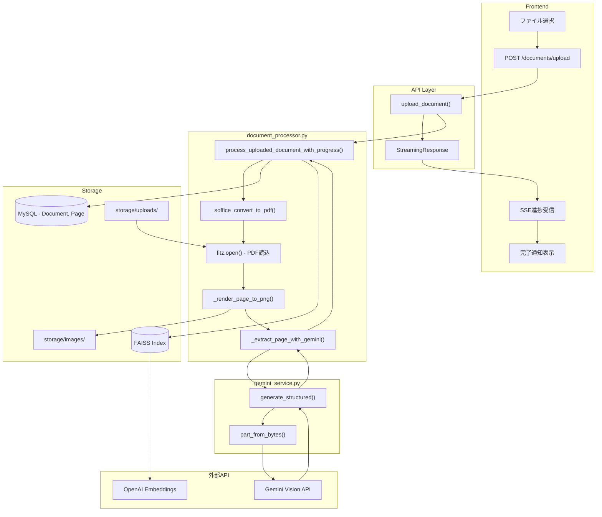
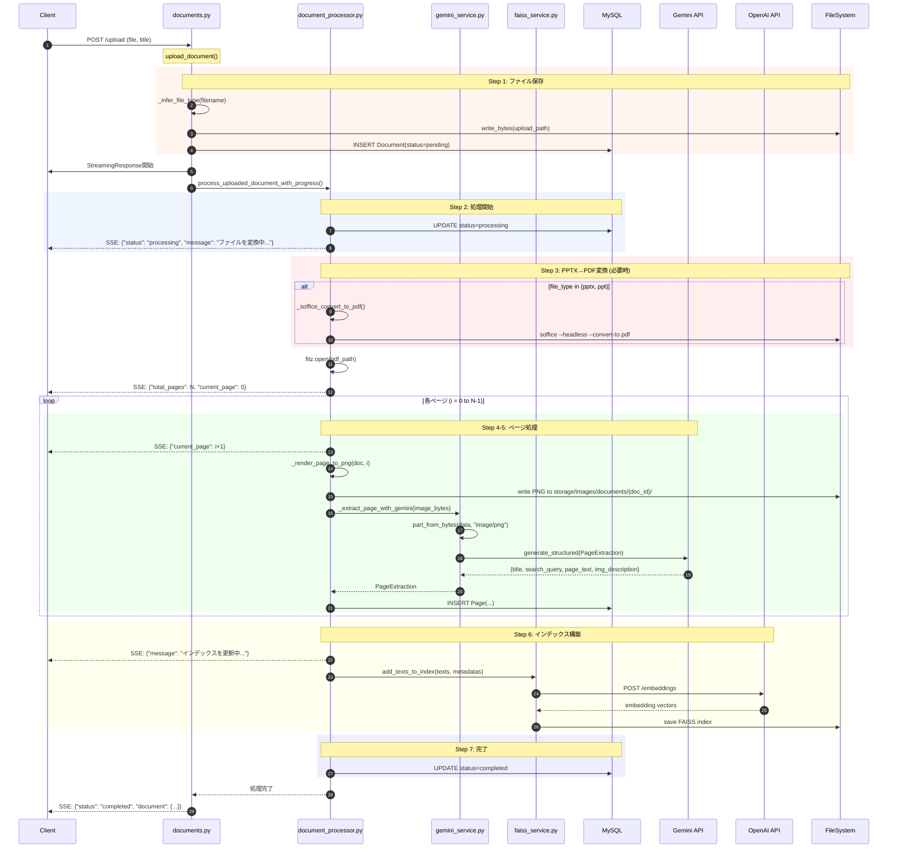
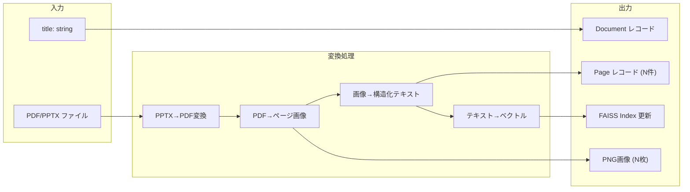
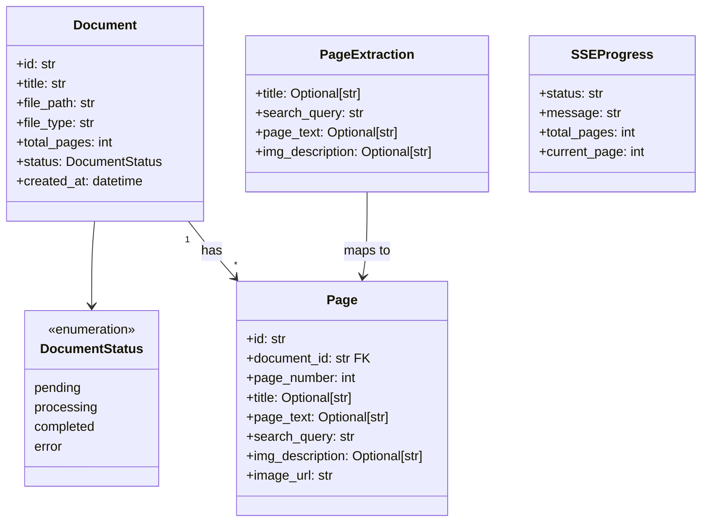
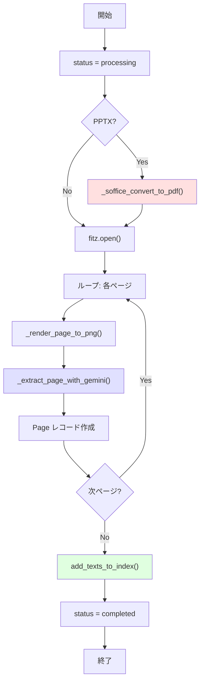
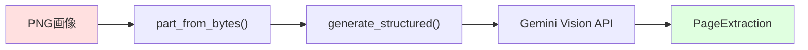
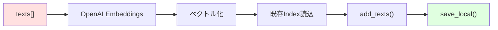
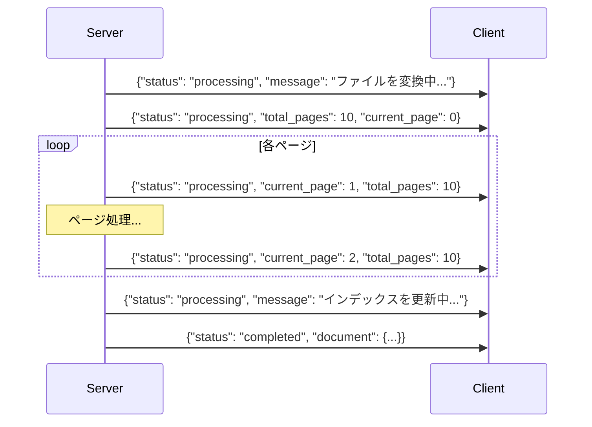
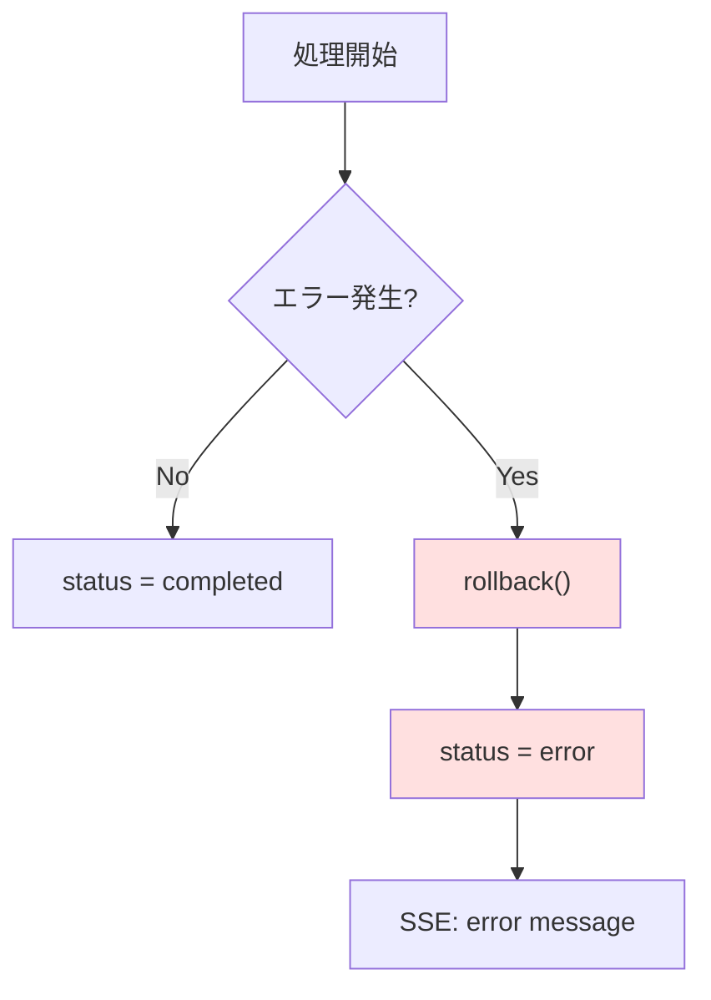
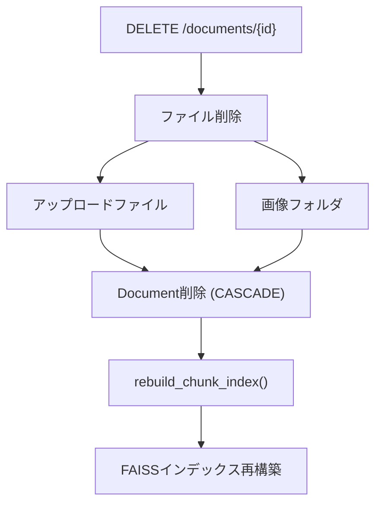

# 機能2: ドキュメント処理 - 詳細コード解析

## 概要

PDF/PPTXをアップロード → ページ分割 → OCR/画像解析 → インデックス登録を行うドキュメント処理機能。
SSE（Server-Sent Events）でリアルタイムに処理進捗をストリーミング。

---

## 全体フロー図



---

## 関数呼び出しシーケンス図



---

## データフロー詳細

### 入力 → 出力の変換



### 各ステップのデータ形式

| Step | 関数 | 入力 | 出力 |
|:----:|------|------|------|
| 1 | `upload_document()` | `UploadFile, title` | `Document(status=pending)` |
| 2 | `process_uploaded_document_with_progress()` | `Document, input_file_path` | SSE stream |
| 3 | `_soffice_convert_to_pdf()` | `Path (PPTX)` | `Path (PDF)` |
| 4 | `_render_page_to_png()` | `fitz.Document, page_index` | `bytes (PNG)` |
| 5 | `_extract_page_with_gemini()` | `bytes (PNG)` | `PageExtraction` |
| 6 | `add_texts_to_index()` | `texts[], metadatas[]` | FAISS Index |

---

## 主要クラス/型定義



---

## 関数詳細

### 1. `upload_document()` - APIエンドポイント

```python
# ファイル: documents.py:35-92
@router.post("/upload", status_code=status.HTTP_201_CREATED)
async def upload_document(db, file, title):
    # ファイルタイプ検証
    file_type = _infer_file_type(file.filename)  # pdf, pptx, ppt のみ許可

    # ファイル保存
    upload_path = settings.uploads_dir / f"{document_id}.{file_type}"
    upload_path.write_bytes(content)

    # Document レコード作成
    doc = Document(id=document_id, title=safe_title, ...)
    db.add(doc)

    # SSEストリーミング開始
    return StreamingResponse(generate_progress(), media_type="text/event-stream")
```

### 2. `process_uploaded_document_with_progress()` - 処理本体



### 3. `_soffice_convert_to_pdf()` - LibreOffice変換

```python
# ファイル: document_processor.py:34-53
def _soffice_convert_to_pdf(input_path: Path, out_dir: Path) -> Path:
    cmd = [
        "soffice",
        "--headless",
        "--convert-to", "pdf",
        "--outdir", str(out_dir),
        str(input_path),
    ]
    subprocess.run(cmd, check=True)
    return out_dir / (input_path.stem + ".pdf")
```

**依存関係**: LibreOffice (`soffice`) がシステムにインストールされている必要あり

### 4. `_render_page_to_png()` - ページレンダリング

```python
# ファイル: document_processor.py:56-62
def _render_page_to_png(doc: fitz.Document, page_index: int, out_path: Path, dpi=200):
    page = doc.load_page(page_index)
    pix = page.get_pixmap(dpi=dpi)
    img_bytes = pix.tobytes("png")
    out_path.write_bytes(img_bytes)
    return img_bytes
```

**パラメータ**:
- `dpi=200`: 高解像度でOCR精度を確保

### 5. `_extract_page_with_gemini()` - Gemini Vision解析



**プロンプト構造**:
```
この画像はテナント向けマニュアルの1ページです。
以下の情報を漏れなく抽出してください。
1. ベクトル検索に使用する検索クエリ（短いキーワード/フレーズ）
2. OCRで抽出した本文テキスト
3. 図表/地図/フロー図の説明
4. ページの見出し/タイトル
```

**出力スキーマ**: `PageExtraction`
```json
{
  "title": "駐車場利用ガイド",
  "search_query": "駐車場 利用 ルール 料金",
  "page_text": "駐車場のご利用について...",
  "img_description": "駐車場レイアウト図。A棟、B棟の位置と..."
}
```

**ファイルサイズによる分岐**:
- 18MB未満: `part_from_bytes()` でインライン送信
- 18MB以上: `upload_file()` で Files API 使用

### 6. `add_texts_to_index()` - FAISSインデックス追加



**メタデータ構造**:
```json
{
  "page_id": "uuid",
  "document_id": "uuid",
  "page_number": 1,
  "detail_description": "【タイトル】...\n【本文テキスト】...",
  "image_url": "/static/images/documents/{doc_id}/page_1.png"
}
```

---

## ストレージ構造

```
storage/
├── uploads/          # アップロードファイル
│   └── {document_id}.pdf
├── images/           # ページ画像
│   └── documents/
│       └── {document_id}/
│           ├── page_1.png
│           ├── page_2.png
│           └── ...
├── faiss/            # FAISSインデックス
│   ├── chunk_faiss/
│   │   ├── index.faiss
│   │   └── index.pkl
│   └── faq_faiss/
│       ├── index.faiss
│       └── index.pkl
└── tmp/              # 一時ファイル (PPTX→PDF変換)
```

---

## SSE進捗イベント



---

## エラーハンドリング



**エラー時の動作**:
1. DBトランザクションをロールバック
2. `Document.status` を `error` に更新
3. SSEでエラーメッセージを送信

---

## 削除処理



**カスケード削除**: `Document` 削除時に関連する `Page` も自動削除

---

## ファイル対応表

| ファイル | 主要関数 | 責務 |
|---------|---------|------|
| [documents.py](file:///Users/t/Projects/RAG/tenant-ai-assistant-mvp/backend/app/api/v1/endpoints/documents.py#L35-92) | `upload_document()` | アップロードAPI、SSEストリーミング |
| [documents.py](file:///Users/t/Projects/RAG/tenant-ai-assistant-mvp/backend/app/api/v1/endpoints/documents.py#L120-147) | `delete_document()` | ドキュメント削除 + インデックス再構築 |
| [document_processor.py](file:///Users/t/Projects/RAG/tenant-ai-assistant-mvp/backend/app/services/document_processor.py#L127-238) | `process_uploaded_document_with_progress()` | ドキュメント処理本体 |
| [document_processor.py](file:///Users/t/Projects/RAG/tenant-ai-assistant-mvp/backend/app/services/document_processor.py#L34-53) | `_soffice_convert_to_pdf()` | PPTX→PDF変換 |
| [document_processor.py](file:///Users/t/Projects/RAG/tenant-ai-assistant-mvp/backend/app/services/document_processor.py#L56-62) | `_render_page_to_png()` | ページ画像生成 |
| [document_processor.py](file:///Users/t/Projects/RAG/tenant-ai-assistant-mvp/backend/app/services/document_processor.py#L72-110) | `_extract_page_with_gemini()` | Gemini Vision OCR/解析 |
| [gemini_service.py](file:///Users/t/Projects/RAG/tenant-ai-assistant-mvp/backend/app/services/gemini_service.py#L53-78) | `generate_structured()` | 構造化出力生成 |
| [indexer.py](file:///Users/t/Projects/RAG/tenant-ai-assistant-mvp/backend/app/services/indexer.py#L25-51) | `rebuild_chunk_index()` | FAISSインデックス全再構築 |

---

## コードリーディングのポイント

1. **エントリポイント**: `upload_document()` から読み始める
2. **SSEパターン**: `StreamingResponse` + `async generator` で進捗配信
3. **PyMuPDF (fitz)**: PDFのページ分割・画像化に使用
4. **Gemini Vision**: 画像からの構造化データ抽出（OCR + 理解）
5. **インクリメンタル更新**: `add_texts_to_index()` で既存インデックスに追加
6. **削除時は全再構築**: `rebuild_chunk_index()` で整合性を保証
