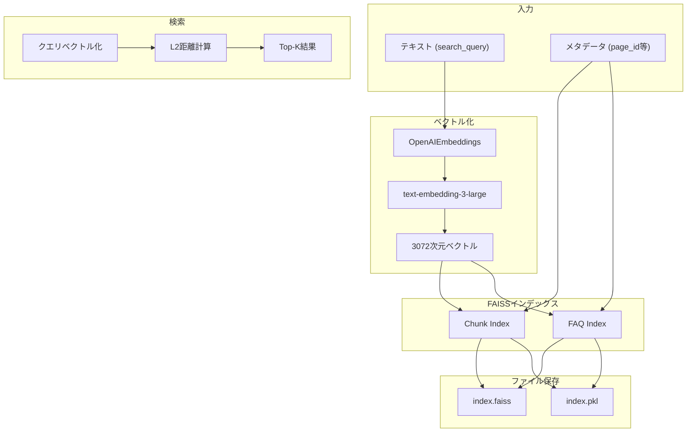
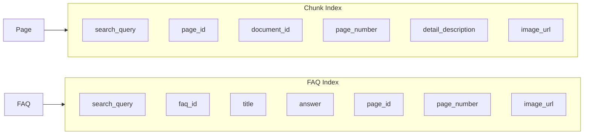
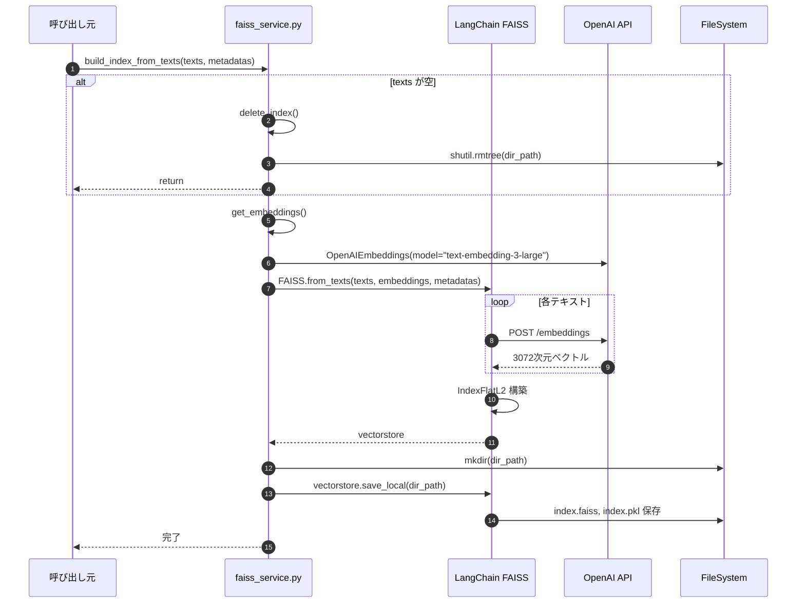
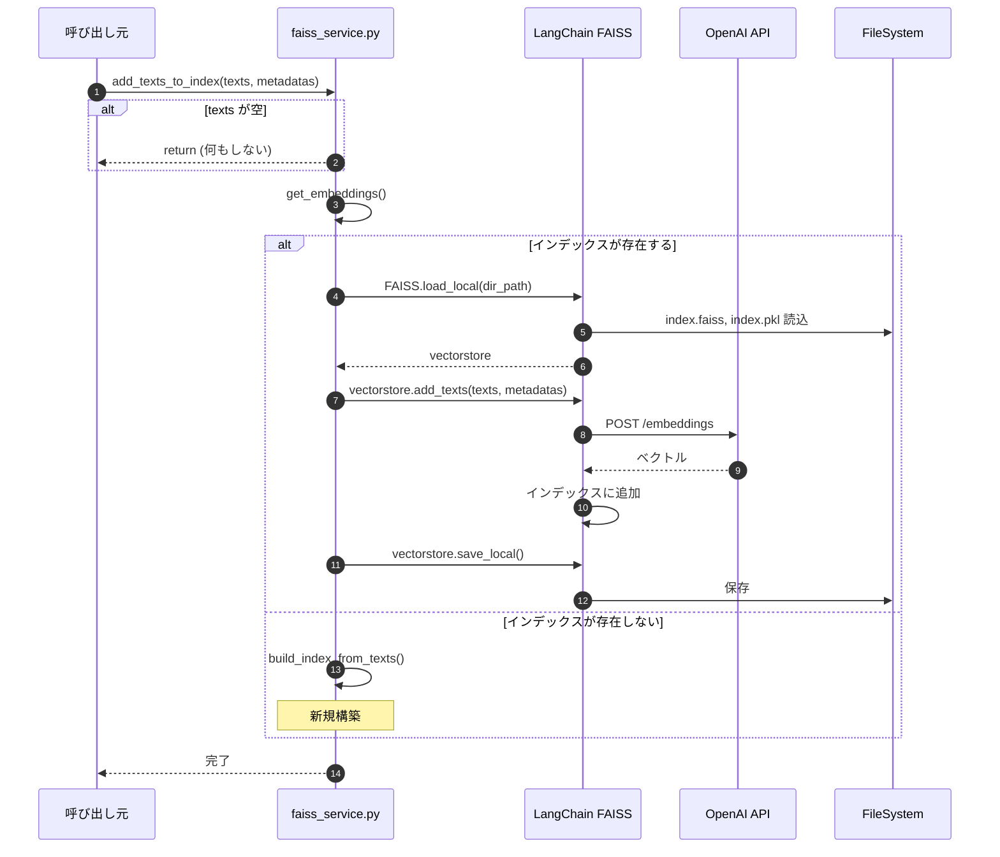
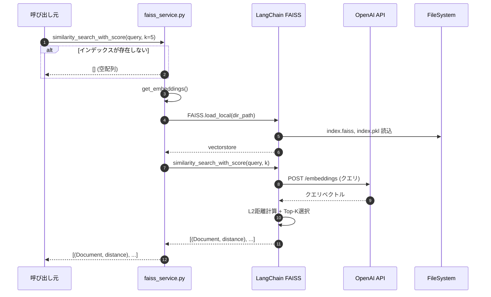
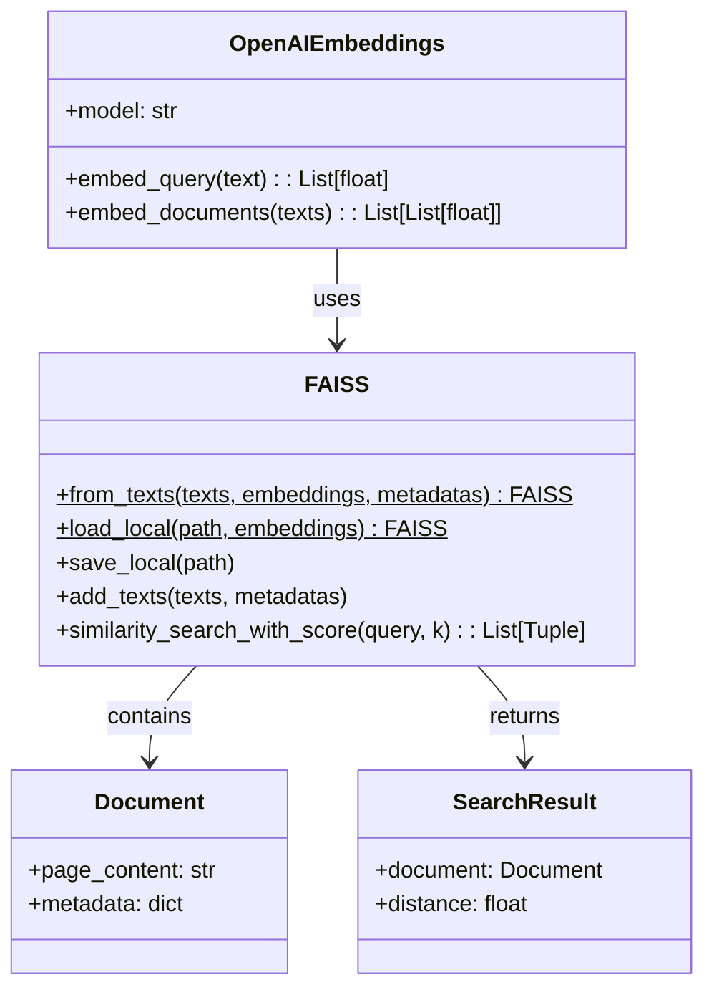
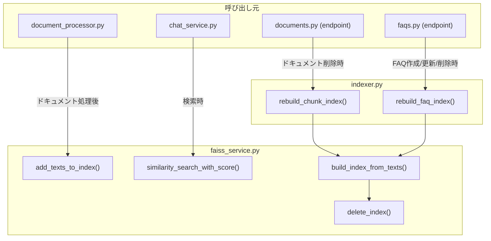
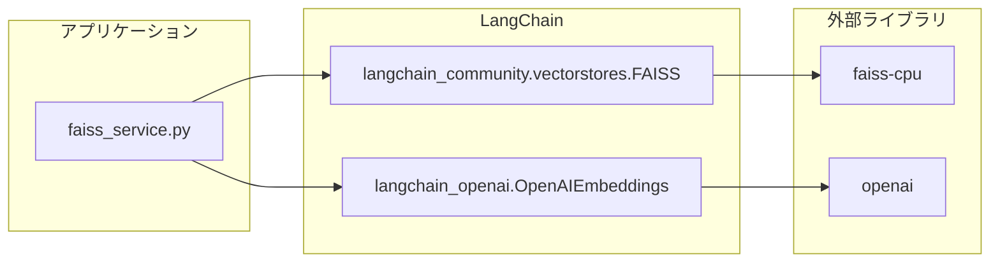

# 機能3: ベクトル検索インデックス - 詳細コード解析

## 概要

OpenAI Embeddings でテキストをベクトル化し、FAISS（Facebook AI Similarity Search）で高速類似検索を実現する機能。
LangChain の FAISS ラッパーを使用。

---

## アーキテクチャ概要



---

## インデックスの種類



| インデックス | ディレクトリ | 格納データ | 用途 |
|-------------|-------------|-----------|------|
| Chunk | `storage/faiss/chunk_faiss/` | ページの search_query + メタデータ | ドキュメント検索 |
| FAQ | `storage/faiss/faq_faiss/` | FAQの search_query + 回答 | FAQ類似検索 |

---

## 処理フロー

### インデックス構築フロー



### インデックス追加フロー



### 検索フロー



---

## 主要クラス/型定義



---

## 関数詳細

### 1. `get_embeddings()` - Embeddingクライアント取得

```python
# ファイル: faiss_service.py:13-16
def get_embeddings() -> OpenAIEmbeddings:
    return OpenAIEmbeddings(model=settings.openai_embedding_model)
```

**設定値**:
- モデル: `text-embedding-3-large`
- 次元数: 3072
- API: OpenAI Embeddings API

### 2. `build_index_from_texts()` - インデックス構築

```python
# ファイル: faiss_service.py:28-36
def build_index_from_texts(*, dir_path, texts, metadatas):
    if not texts:
        delete_index(dir_path)  # 空なら削除
        return

    embeddings = get_embeddings()
    vectorstore = FAISS.from_texts(texts, embeddings, metadatas)
    vectorstore.save_local(str(dir_path))
```

**動作**:
1. テキストが空 → インデックス削除
2. テキストあり → 新規構築して保存

### 3. `add_texts_to_index()` - インデックス追加

```python
# ファイル: faiss_service.py:39-49
def add_texts_to_index(*, dir_path, texts, metadatas):
    if not texts:
        return

    embeddings = get_embeddings()
    if _index_exists(dir_path):
        vectorstore = FAISS.load_local(dir_path, embeddings, ...)
        vectorstore.add_texts(texts, metadatas)
        vectorstore.save_local(dir_path)
    else:
        build_index_from_texts(...)  # 新規作成
```

**動作**:
1. テキストが空 → 何もしない
2. インデックスあり → 読込 → 追加 → 保存
3. インデックスなし → 新規構築

### 4. `similarity_search_with_score()` - 類似検索

```python
# ファイル: faiss_service.py:52-57
def similarity_search_with_score(*, dir_path, query, k):
    if not _index_exists(dir_path):
        return []
    embeddings = get_embeddings()
    vectorstore = FAISS.load_local(dir_path, embeddings, ...)
    return vectorstore.similarity_search_with_score(query, k=k)
```

**戻り値**: `List[Tuple[Document, float]]`
- `Document.page_content`: 元のテキスト (search_query)
- `Document.metadata`: メタデータ (page_id, detail_description 等)
- `float`: L2距離 (小さいほど類似)

### 5. `rebuild_chunk_index()` - Chunkインデックス再構築

```python
# ファイル: indexer.py:25-51
async def rebuild_chunk_index(db: AsyncSession):
    pages = await db.execute(select(Page).order_by(...))

    texts = [p.search_query for p in pages if p.search_query]
    metadatas = [{
        "page_id": p.id,
        "document_id": p.document_id,
        "page_number": p.page_number,
        "detail_description": _page_detail_description(p),
        "image_url": p.image_url,
    } for p in pages]

    await asyncio.to_thread(
        faiss_service.build_index_from_texts,
        dir_path=settings.chunk_faiss_dir,
        texts=texts, metadatas=metadatas,
    )
```

**呼び出しタイミング**:
- ドキュメント削除時

### 6. `rebuild_faq_index()` - FAQインデックス再構築

```python
# ファイル: indexer.py:53-84
async def rebuild_faq_index(db: AsyncSession):
    faqs = await db.execute(select(FAQ, Page).outerjoin(...))

    texts = [faq.search_query for faq, _ in faqs]
    metadatas = [{
        "faq_id": faq.id,
        "title": faq.title,
        "answer": faq.answer,
        "page_id": faq.page_id,
        "page_number": page.page_number if page else None,
        "image_url": page.image_url if page else None,
    } for faq, page in faqs]

    await asyncio.to_thread(
        faiss_service.build_index_from_texts,
        dir_path=settings.faq_faiss_dir,
        texts=texts, metadatas=metadatas,
    )
```

**呼び出しタイミング**:
- FAQ 作成/更新/削除時

---

## ストレージ構造

```
storage/faiss/
├── chunk_faiss/
│   ├── index.faiss    # FAISSバイナリインデックス
│   └── index.pkl      # メタデータ (pickle)
└── faq_faiss/
    ├── index.faiss
    └── index.pkl
```

**ファイル形式**:
| ファイル | 形式 | 内容 |
|---------|------|------|
| `index.faiss` | バイナリ | FAISSインデックス (ベクトル + 内部構造) |
| `index.pkl` | Pickle | LangChain Document オブジェクト (メタデータ含む) |

---

## 距離とスコア変換


**変換式** (chat_service.py で使用):
```python
def _distance_to_relevance(distance: float) -> float:
    return 1.0 / (1.0 + distance)
```

| L2距離 | 関連度スコア | 解釈 |
|--------|-------------|------|
| 0.0 | 1.0 | 完全一致 |
| 0.5 | 0.67 | 高い類似度 |
| 1.0 | 0.5 | 中程度 |
| 2.0 | 0.33 | 低い類似度 |

---

## 呼び出し関係図



---

## 使用ライブラリ



**依存関係**:
| ライブラリ | バージョン | 用途 |
|-----------|-----------|------|
| `langchain-openai` | - | OpenAI Embeddings ラッパー |
| `langchain-community` | - | FAISS ベクトルストア ラッパー |
| `faiss-cpu` | - | ベクトル類似検索エンジン |
| `openai` | - | OpenAI API クライアント |

---

## ファイル対応表

| ファイル | 主要関数 | 責務 |
|---------|---------|------|
| [faiss_service.py](file:///Users/t/Projects/RAG/tenant-ai-assistant-mvp/backend/app/services/faiss_service.py#L13-16) | `get_embeddings()` | Embeddingクライアント取得 |
| [faiss_service.py](file:///Users/t/Projects/RAG/tenant-ai-assistant-mvp/backend/app/services/faiss_service.py#L28-36) | `build_index_from_texts()` | インデックス新規構築 |
| [faiss_service.py](file:///Users/t/Projects/RAG/tenant-ai-assistant-mvp/backend/app/services/faiss_service.py#L39-49) | `add_texts_to_index()` | インデックス追加 |
| [faiss_service.py](file:///Users/t/Projects/RAG/tenant-ai-assistant-mvp/backend/app/services/faiss_service.py#L52-57) | `similarity_search_with_score()` | 類似検索 |
| [indexer.py](file:///Users/t/Projects/RAG/tenant-ai-assistant-mvp/backend/app/services/indexer.py#L25-51) | `rebuild_chunk_index()` | Chunkインデックス全再構築 |
| [indexer.py](file:///Users/t/Projects/RAG/tenant-ai-assistant-mvp/backend/app/services/indexer.py#L53-84) | `rebuild_faq_index()` | FAQインデックス全再構築 |

---

## コードリーディングのポイント

1. **LangChain ラッパー**: 直接FAISSを使わず LangChain の抽象化を利用
2. **同期関数**: `faiss_service.py` の関数は同期。呼び出し側で `asyncio.to_thread()` 使用
3. **allow_dangerous_deserialization**: Pickle デシリアライズの許可フラグ（信頼できるデータのみ）
4. **2種類のインデックス**: Chunk（ページ）と FAQ で別々に管理
5. **距離変換**: FAISSはL2距離を返すため、スコア変換が必要
6. **インクリメンタル vs 全再構築**: 追加は `add_texts_to_index()`、削除は全再構築
