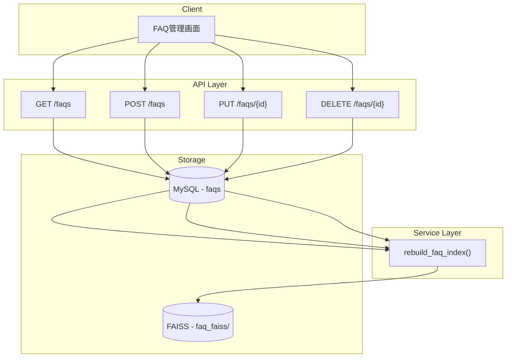
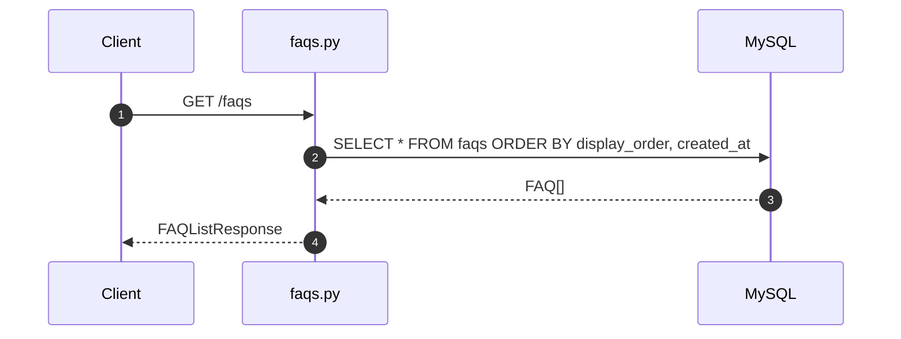
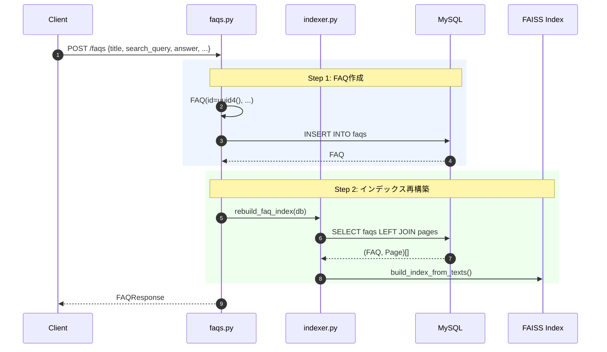
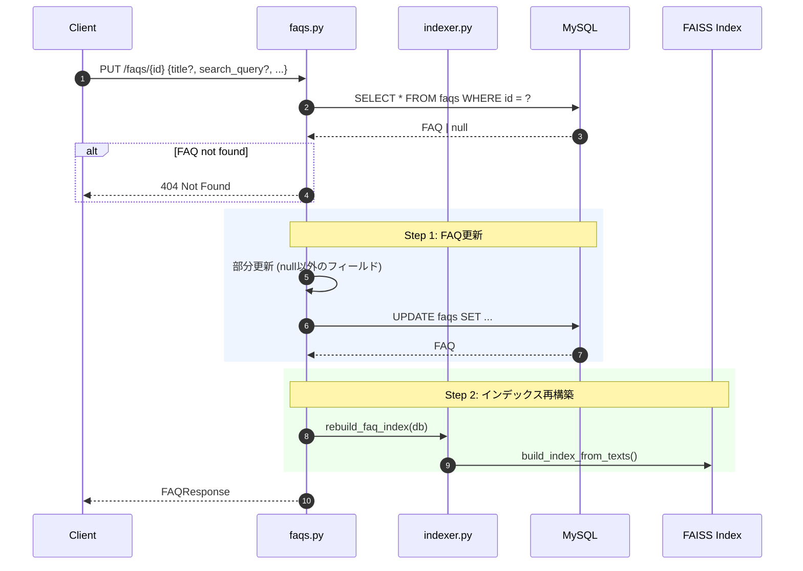
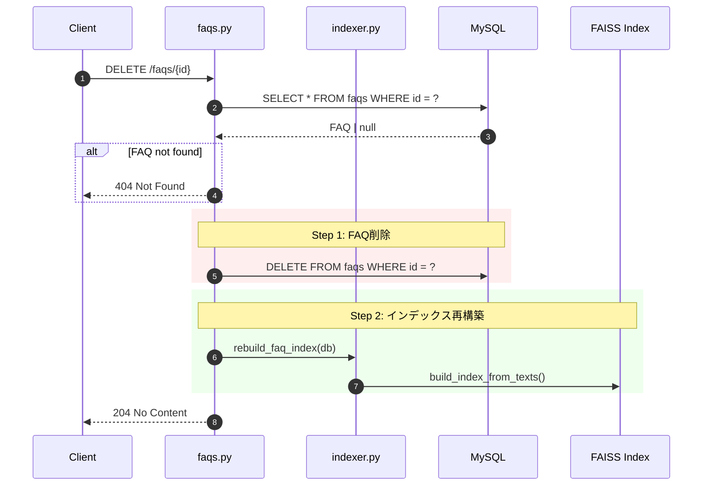
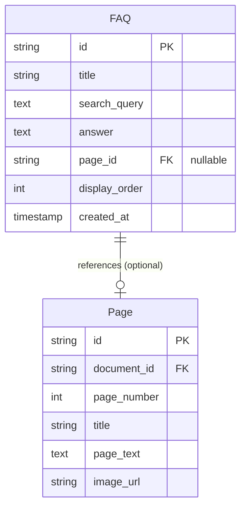
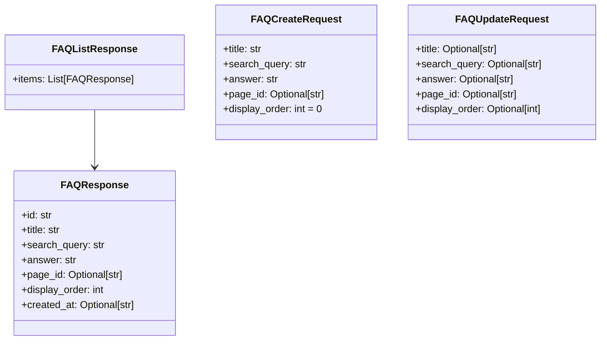
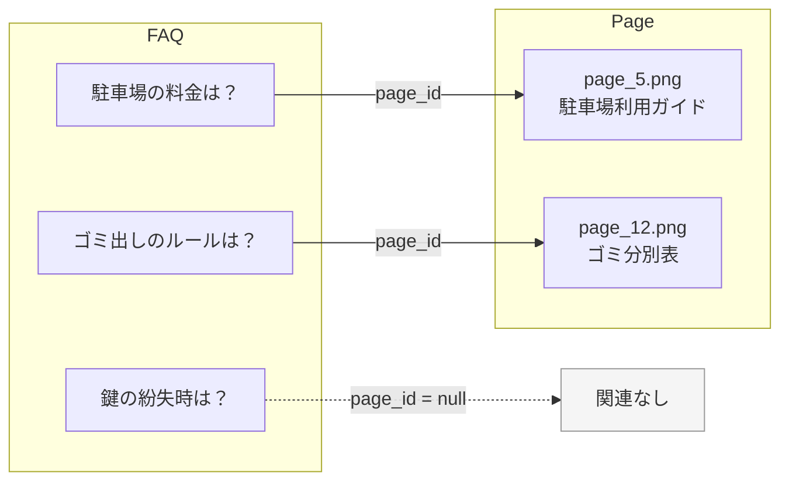
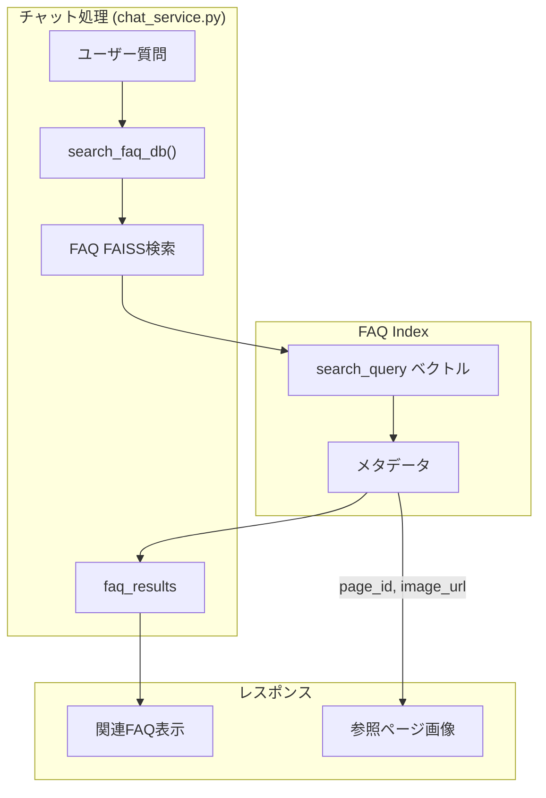

# 機能4: FAQ管理 - 詳細コード解析

## 概要

よくある質問（FAQ）を管理し、ベクトル検索可能にする機能。
シンプルなCRUD操作と、変更時の自動インデックス再構築を提供。

---

## アーキテクチャ概要



---

## エンドポイント一覧

| Method | Path | 説明 | インデックス再構築 |
|--------|------|------|:------------------:|
| GET | `/api/v1/faqs` | FAQ一覧取得 | - |
| POST | `/api/v1/faqs` | FAQ作成 | Yes |
| PUT | `/api/v1/faqs/{id}` | FAQ更新 | Yes |
| DELETE | `/api/v1/faqs/{id}` | FAQ削除 | Yes |

---

## CRUD処理フロー

### 一覧取得 (GET)



### 作成 (POST)



### 更新 (PUT)



### 削除 (DELETE)



---

## データモデル

### ER図



### FAQエンティティ

```python
# ファイル: entities.py:82-98
class FAQ(Base):
    __tablename__ = "faqs"

    id: str              # UUID (PK)
    title: str           # FAQ タイトル (表示用)
    search_query: str    # ベクトル検索用クエリ
    answer: str          # 回答テキスト
    page_id: str | None  # 関連ページ (FK, nullable)
    display_order: int   # 表示順序 (デフォルト: 0)
    created_at: datetime # 作成日時

    page: Page | None    # リレーション
```

**フィールド説明**:

| フィールド | 型 | 説明 |
|-----------|-----|------|
| `id` | UUID | 一意識別子 |
| `title` | string | ユーザーに表示するFAQタイトル |
| `search_query` | text | ベクトル検索に使用するキーワード/フレーズ |
| `answer` | text | FAQの回答本文 |
| `page_id` | UUID? | 関連ページへの参照（任意） |
| `display_order` | int | 一覧での表示順序 |

---

## スキーマ定義



### リクエスト/レスポンス例

**POST /faqs (作成)**:
```json
// Request
{
  "title": "駐車場の料金は？",
  "search_query": "駐車場 料金 月額 費用",
  "answer": "月額駐車場は1台につき15,000円です。来客用駐車場は無料でご利用いただけます。",
  "page_id": "abc-123",
  "display_order": 1
}

// Response
{
  "id": "faq-uuid-001",
  "title": "駐車場の料金は？",
  "search_query": "駐車場 料金 月額 費用",
  "answer": "月額駐車場は1台につき15,000円です。...",
  "page_id": "abc-123",
  "display_order": 1,
  "created_at": "2024-01-15T10:30:00"
}
```

**PUT /faqs/{id} (部分更新)**:
```json
// Request - 回答のみ更新
{
  "answer": "月額駐車場は1台につき18,000円に改定されました。"
}

// Response
{
  "id": "faq-uuid-001",
  "title": "駐車場の料金は？",
  "search_query": "駐車場 料金 月額 費用",
  "answer": "月額駐車場は1台につき18,000円に改定されました。",
  "page_id": "abc-123",
  "display_order": 1,
  "created_at": "2024-01-15T10:30:00"
}
```

---

## 関数詳細

### 1. `list_faqs()` - 一覧取得

```python
# ファイル: faqs.py:17-21
@router.get("", response_model=FAQListResponse)
async def list_faqs(db: AsyncSession = Depends(get_db)):
    res = await db.execute(
        select(FAQ).order_by(FAQ.display_order.asc(), FAQ.created_at.asc())
    )
    faqs = list(res.scalars().all())
    return FAQListResponse(items=[FAQResponse.model_validate(f) for f in faqs])
```

**ソート順序**:
1. `display_order` 昇順
2. `created_at` 昇順

### 2. `create_faq()` - 作成

```python
# ファイル: faqs.py:24-40
@router.post("", response_model=FAQResponse, status_code=201)
async def create_faq(req: FAQCreateRequest, db: AsyncSession = Depends(get_db)):
    faq = FAQ(
        id=str(uuid4()),
        title=req.title,
        search_query=req.search_query,
        answer=req.answer,
        page_id=req.page_id,
        display_order=req.display_order,
    )
    db.add(faq)
    await db.commit()
    await db.refresh(faq)

    await rebuild_faq_index(db)  # インデックス再構築

    return FAQResponse.model_validate(faq)
```

### 3. `update_faq()` - 更新

```python
# ファイル: faqs.py:43-66
@router.put("/{faq_id}", response_model=FAQResponse)
async def update_faq(faq_id: str, req: FAQUpdateRequest, db):
    faq = await db.execute(select(FAQ).where(FAQ.id == faq_id))
    if not faq:
        raise HTTPException(status_code=404, detail="FAQ not found")

    # 部分更新: None でないフィールドのみ更新
    if req.title is not None:
        faq.title = req.title
    if req.search_query is not None:
        faq.search_query = req.search_query
    # ... 他フィールドも同様

    await db.commit()
    await rebuild_faq_index(db)  # インデックス再構築

    return FAQResponse.model_validate(faq)
```

**部分更新パターン**: リクエストで `None` のフィールドは更新しない

### 4. `delete_faq()` - 削除

```python
# ファイル: faqs.py:69-81
@router.delete("/{faq_id}", status_code=204)
async def delete_faq(faq_id: str, db):
    faq = await db.execute(select(FAQ).where(FAQ.id == faq_id))
    if not faq:
        raise HTTPException(status_code=404, detail="FAQ not found")

    await db.delete(faq)
    await db.commit()
    await rebuild_faq_index(db)  # インデックス再構築

    return None
```

---

## インデックス再構築

### rebuild_faq_index()

```python
# ファイル: indexer.py:53-84
async def rebuild_faq_index(db: AsyncSession):
    # FAQ と Page を LEFT JOIN で取得
    stmt = select(FAQ, Page).select_from(
        outerjoin(FAQ, Page, FAQ.page_id == Page.id)
    ).order_by(FAQ.display_order.asc(), FAQ.created_at.asc())

    res = await db.execute(stmt)

    texts = []
    metadatas = []
    for faq, page in res.all():
        texts.append(faq.search_query)
        metadatas.append({
            "faq_id": faq.id,
            "title": faq.title,
            "answer": faq.answer,
            "page_id": faq.page_id,
            "page_number": page.page_number if page else None,
            "image_url": page.image_url if page else None,
        })

    await asyncio.to_thread(
        faiss_service.build_index_from_texts,
        dir_path=settings.faq_faiss_dir,
        texts=texts,
        metadatas=metadatas,
    )
```

### FAQインデックスのメタデータ構造

```json
{
  "faq_id": "uuid",
  "title": "駐車場の料金は？",
  "answer": "月額駐車場は1台につき15,000円です。",
  "page_id": "page-uuid",
  "page_number": 5,
  "image_url": "/static/images/documents/.../page_5.png"
}
```

---

## FAQとページの関連



**page_id の用途**:
- チャット回答時にFAQがヒットした場合、関連ページ画像を表示可能
- `page_id = null` の場合は回答テキストのみ

---

## チャット機能との連携



**検索結果の使用**:
1. `search_query` でベクトル類似検索
2. ヒットしたFAQの `title`, `answer` を関連FAQとして表示
3. `page_id` があれば参照ページ画像も表示可能

---

## エラーハンドリング

| 状況 | HTTPステータス | エラーメッセージ |
|------|---------------|-----------------|
| FAQ存在しない (更新時) | 404 | "FAQ not found" |
| FAQ存在しない (削除時) | 404 | "FAQ not found" |
| バリデーションエラー | 422 | Pydantic詳細 |

---

## ファイル対応表

| ファイル | 主要関数/クラス | 責務 |
|---------|----------------|------|
| [faqs.py (endpoint)](file:///Users/t/Projects/RAG/tenant-ai-assistant-mvp/backend/app/api/v1/endpoints/faqs.py#L17-21) | `list_faqs()` | FAQ一覧取得 |
| [faqs.py (endpoint)](file:///Users/t/Projects/RAG/tenant-ai-assistant-mvp/backend/app/api/v1/endpoints/faqs.py#L24-40) | `create_faq()` | FAQ作成 |
| [faqs.py (endpoint)](file:///Users/t/Projects/RAG/tenant-ai-assistant-mvp/backend/app/api/v1/endpoints/faqs.py#L43-66) | `update_faq()` | FAQ更新 (部分更新) |
| [faqs.py (endpoint)](file:///Users/t/Projects/RAG/tenant-ai-assistant-mvp/backend/app/api/v1/endpoints/faqs.py#L69-81) | `delete_faq()` | FAQ削除 |
| [faqs.py (schema)](file:///Users/t/Projects/RAG/tenant-ai-assistant-mvp/backend/app/schemas/faqs.py#L11-18) | `FAQResponse` | レスポンス型 |
| [faqs.py (schema)](file:///Users/t/Projects/RAG/tenant-ai-assistant-mvp/backend/app/schemas/faqs.py#L25-30) | `FAQCreateRequest` | 作成リクエスト型 |
| [faqs.py (schema)](file:///Users/t/Projects/RAG/tenant-ai-assistant-mvp/backend/app/schemas/faqs.py#L33-38) | `FAQUpdateRequest` | 更新リクエスト型 |
| [entities.py](file:///Users/t/Projects/RAG/tenant-ai-assistant-mvp/backend/app/models/entities.py#L82-98) | `FAQ` | FAQエンティティ |
| [indexer.py](file:///Users/t/Projects/RAG/tenant-ai-assistant-mvp/backend/app/services/indexer.py#L53-84) | `rebuild_faq_index()` | FAQインデックス再構築 |

---

## コードリーディングのポイント

1. **シンプルなCRUDパターン**: FastAPI + SQLAlchemy の標準的な実装
2. **部分更新**: `None` チェックで必要なフィールドのみ更新
3. **自動インデックス再構築**: 作成/更新/削除のたびに全再構築
4. **Page連携**: LEFT JOIN で関連ページ情報を取得
5. **ソート順序**: `display_order` → `created_at` の2段階ソート
6. **検索用と表示用の分離**: `search_query` (検索) と `title` (表示) を別管理
