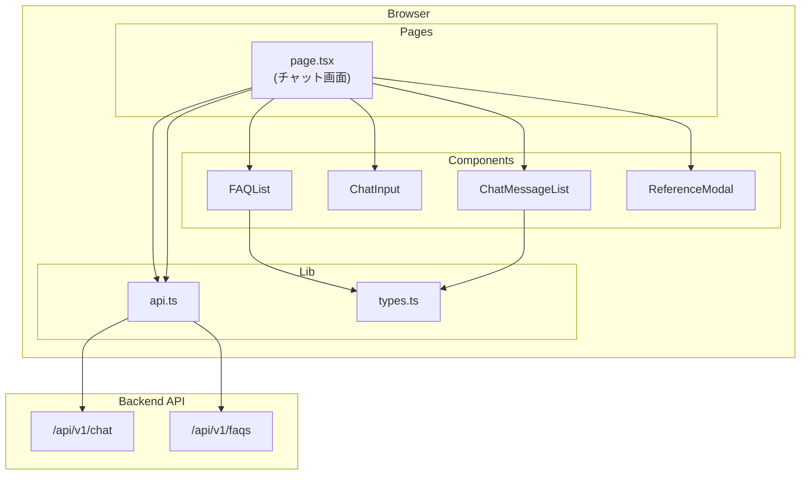
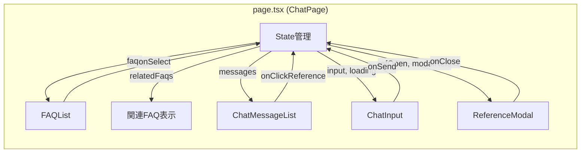
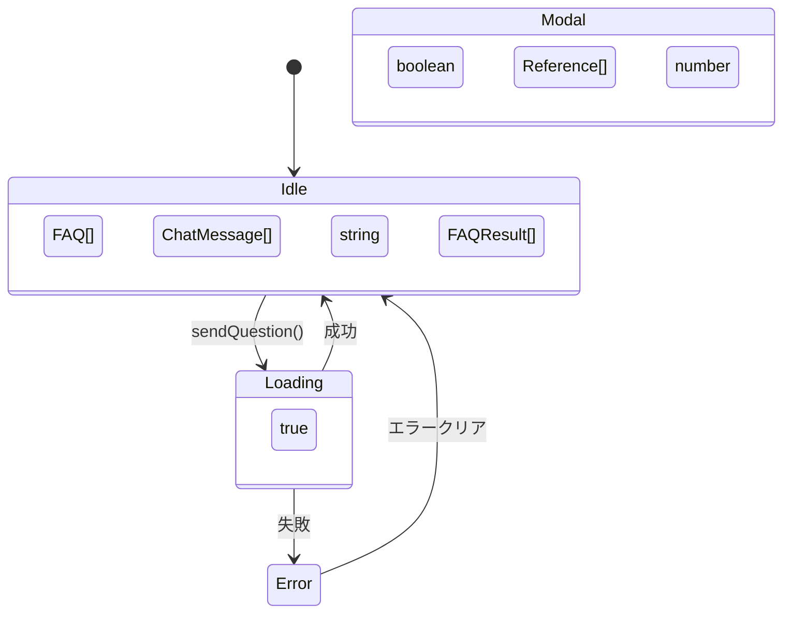
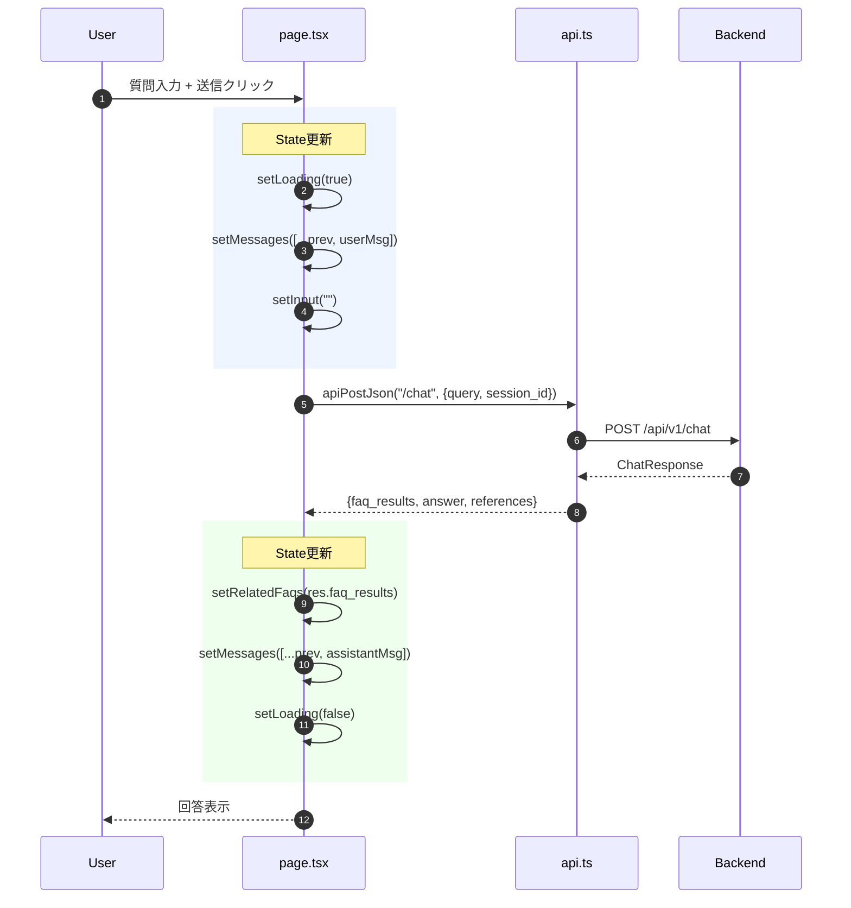
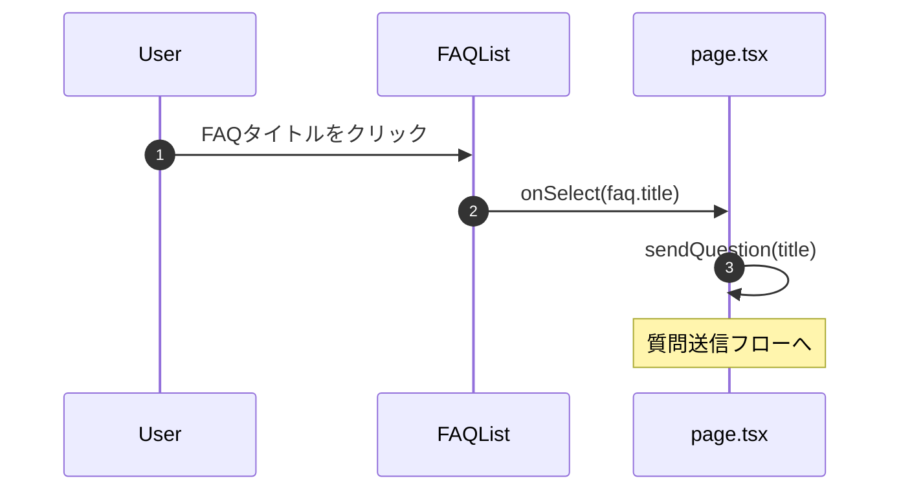
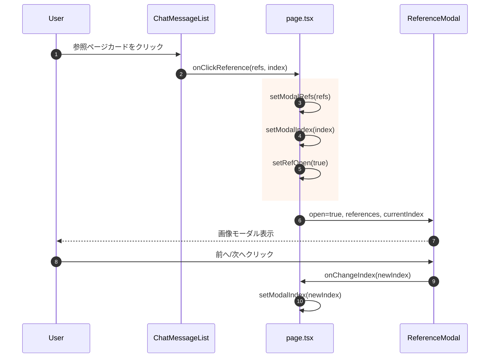
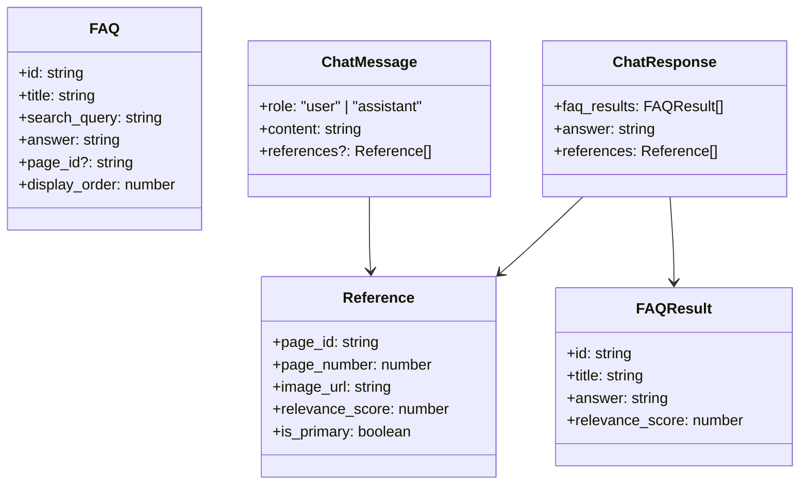

# 機能5: フロントエンドUI - 詳細コード解析

## 概要

Next.js (App Router) + MUI (Material-UI) でチャットUIを構築。
ユーザーはFAQを閲覧し、質問を入力、AIからの回答と参照ページを確認できる。

---

## アーキテクチャ概要



---

## コンポーネント構成図



---

## 画面レイアウト

```
┌─────────────────────────────────────────────────────┐
│  🏢 テナントAIアシスタント          [管理画面]     │  AppBar
├─────────────────────────────────────────────────────┤
│  ┌───────────────────────────────────────────────┐  │
│  │  よくある質問                                 │  │  FAQList
│  │  📋 駐車場の料金は？  [▼]                     │  │  (Accordion)
│  │  📋 ゴミ出しのルールは？  [▼]                 │  │
│  └───────────────────────────────────────────────┘  │
│                                                     │
│  ┌───────────────────────────────────────────────┐  │
│  │  🔎 関連FAQ候補                               │  │  relatedFaqs
│  │  ・駐車場の料金は？ (score: 0.85)             │  │  (検索結果)
│  └───────────────────────────────────────────────┘  │
│                                                     │
│  ┌───────────────────────────────────────────────┐  │
│  │  会話                                         │  │
│  │  ─────────────────────────────────────────    │  │
│  │                                    👤         │  │  ChatMessageList
│  │  ┌─────────────────────────────────────┐     │  │
│  │  │ 駐車場の料金を教えてください        │     │  │
│  │  └─────────────────────────────────────┘     │  │
│  │  🤖                                           │  │
│  │  ┌─────────────────────────────────────┐     │  │
│  │  │ 月額駐車場は1台につき15,000円です。 │     │  │
│  │  │ 📄 参照ページ                       │     │  │
│  │  │ [P.5 ★最重視] [P.12 参照]           │     │  │
│  │  └─────────────────────────────────────┘     │  │
│  │  ─────────────────────────────────────────    │  │
│  │  [ご質問を入力...                  ] [送信]  │  │  ChatInput
│  └───────────────────────────────────────────────┘  │
└─────────────────────────────────────────────────────┘

┌─────────────────────────────────────────────────────┐
│  参照ページ: P.5 ★最重視                    [×]   │  ReferenceModal
│  ┌───────────────────────────────────────────────┐  │  (Dialog)
│  │                                               │  │
│  │              [ページ画像]                     │  │
│  │                                               │  │
│  └───────────────────────────────────────────────┘  │
│  [◀ 前の参照]                       [次の参照 ▶]   │
└─────────────────────────────────────────────────────┘
```

---

## State管理



### State一覧

| State | 型 | 初期値 | 説明 |
|-------|-----|--------|------|
| `faqs` | `FAQ[]` | `[]` | FAQ一覧 (初回読込) |
| `messages` | `ChatMessage[]` | `[]` | 会話履歴 |
| `input` | `string` | `""` | 入力テキスト |
| `loading` | `boolean` | `false` | 送信中フラグ |
| `error` | `string \| null` | `null` | エラーメッセージ |
| `relatedFaqs` | `FAQResult[]` | `[]` | 検索でヒットした関連FAQ |
| `refOpen` | `boolean` | `false` | モーダル表示フラグ |
| `modalRefs` | `Reference[]` | `[]` | モーダル表示用参照一覧 |
| `modalIndex` | `number` | `0` | 現在表示中の参照インデックス |

---

## データフロー

### 質問送信フロー



### FAQ選択フロー



### 参照モーダル表示フロー



---

## コンポーネント詳細

### 1. page.tsx - メインページ

```typescript
// ファイル: page.tsx:39-185
export default function ChatPage() {
  // State定義
  const [faqs, setFaqs] = useState<FAQ[]>([]);
  const [messages, setMessages] = useState<ChatMessage[]>([]);
  const [loading, setLoading] = useState(false);
  // ...

  // セッションID (localStorage永続化)
  const sessionId = useMemo(() => getOrCreateSessionId(), []);

  // 初回: FAQ一覧取得
  useEffect(() => {
    apiGet<FAQListResponse>("/faqs").then(data => setFaqs(data.items));
  }, []);

  // 質問送信
  const sendQuestion = async (question: string) => {
    setLoading(true);
    setMessages(prev => [...prev, { role: "user", content: question }]);

    const res = await apiPostJson<ChatResponse>("/chat", { query, session_id });

    setRelatedFaqs(res.faq_results);
    setMessages(prev => [...prev, { role: "assistant", content: res.answer, references: res.references }]);
    setLoading(false);
  };

  return (
    <>
      <AppBar>...</AppBar>
      <Container>
        <FAQList faqs={faqs} onSelect={sendQuestion} />
        {relatedFaqs.length > 0 && <関連FAQ表示 />}
        <ChatMessageList messages={messages} onClickReference={...} />
        <ChatInput value={input} onSend={() => sendQuestion(input)} />
      </Container>
      <ReferenceModal open={refOpen} references={modalRefs} ... />
    </>
  );
}
```

**セッション管理**:
```typescript
// ファイル: page.tsx:28-37
function getOrCreateSessionId(): string {
  const key = "tenant_ai_session_id";
  const existing = localStorage.getItem(key);
  if (existing) return existing;

  const sid = `sess_${crypto.randomUUID()}`;
  localStorage.setItem(key, sid);
  return sid;
}
```

### 2. ChatInput.tsx - 入力コンポーネント

```typescript
// ファイル: ChatInput.tsx:6-44
export default function ChatInput({ value, onChange, onSend, disabled }) {
  return (
    <Box sx={{ display: "flex", gap: 1 }}>
      <TextField
        placeholder="ご質問を入力..."
        value={value}
        onChange={(e) => onChange(e.target.value)}
        onKeyDown={(e) => {
          if (e.key === "Enter" && !e.shiftKey) {
            e.preventDefault();
            onSend();
          }
        }}
        multiline
        minRows={1}
        maxRows={4}
      />
      <Button onClick={onSend} disabled={disabled || !value.trim()}>
        送信
      </Button>
    </Box>
  );
}
```

**機能**:
- Enter キーで送信 (Shift+Enter で改行)
- 複数行入力対応 (最大4行)
- 空文字・ローディング中は送信無効

### 3. ChatMessageList.tsx - メッセージ一覧

```typescript
// ファイル: ChatMessageList.tsx:17-21
export type ChatMessage = {
  role: "user" | "assistant";
  content: string;
  references?: Reference[];
};
```

**表示ロジック**:
- `user`: 右寄せ、👤アイコン
- `assistant`: 左寄せ、🤖アイコン
- 参照ページがあれば「📄 参照ページ」カードを表示

### 4. ReferenceModal.tsx - 参照画像モーダル

```typescript
// ファイル: ReferenceModal.tsx:16-79
export default function ReferenceModal({
  open, onClose, references, currentIndex, onChangeIndex
}) {
  const ref = references[currentIndex];

  return (
    <Dialog open={open} maxWidth="lg" fullWidth>
      <DialogTitle>参照ページ: P.{ref.page_number}</DialogTitle>
      <DialogContent>
        
        <Box>
          <Button onClick={() => onChangeIndex(currentIndex - 1)}>◀ 前</Button>
          <Button onClick={() => onChangeIndex(currentIndex + 1)}>次 ▶</Button>
        </Box>
      </DialogContent>
    </Dialog>
  );
}
```

**機能**:
- 参照ページ画像を大きく表示
- 前へ/次へボタンで複数参照を切り替え
- `is_primary` フラグで「★最重視」表示

### 5. FAQList.tsx - FAQ一覧

```typescript
// ファイル: FAQList.tsx:14-49
export default function FAQList({ faqs, onSelect }) {
  return (
    <Box>
      <Typography variant="h6">よくある質問</Typography>
      {faqs.map((faq) => (
        <Accordion key={faq.id}>
          <AccordionSummary>
            <Typography onClick={() => onSelect(faq.title)}>
              📋 {faq.title}
            </Typography>
          </AccordionSummary>
          <AccordionDetails>
            <Typography>{faq.answer}</Typography>
          </AccordionDetails>
        </Accordion>
      ))}
    </Box>
  );
}
```

**機能**:
- アコーディオンで回答を展開/折りたたみ
- タイトルクリックで質問として送信

---

## APIクライアント

### api.ts

```typescript
// ファイル: api.ts:1-5
export const API_BASE = process.env.NEXT_PUBLIC_API_BASE_URL || "http://localhost:8000/api/v1";
export const STATIC_BASE = process.env.NEXT_PUBLIC_STATIC_BASE_URL || "http://localhost:8000";
```

| 関数 | 用途 | 使用箇所 |
|------|------|----------|
| `apiGet<T>(path)` | GET リクエスト | FAQ一覧取得 |
| `apiPostJson<T>(path, body)` | POST (JSON) | チャット送信 |
| `apiPutJson<T>(path, body)` | PUT (JSON) | FAQ更新 (管理画面) |
| `apiDelete(path)` | DELETE | FAQ/ドキュメント削除 |
| `apiPostForm<T>(path, formData)` | POST (FormData) | ドキュメントアップロード |

---

## 型定義

### types.ts



---

## 使用ライブラリ

| ライブラリ | バージョン | 用途 |
|-----------|-----------|------|
| Next.js | 14.x | React フレームワーク (App Router) |
| React | 18.x | UI ライブラリ |
| MUI (@mui/material) | 5.x | UI コンポーネント |
| @mui/icons-material | 5.x | アイコン |

**MUIコンポーネント使用一覧**:
- レイアウト: `Container`, `Box`, `Paper`
- ナビゲーション: `AppBar`, `Toolbar`
- 入力: `TextField`, `Button`
- 表示: `Typography`, `Avatar`, `Chip`, `Alert`
- リスト: `List`, `ListItem`, `ListItemText`
- カード: `Card`, `CardContent`, `CardActionArea`
- アコーディオン: `Accordion`, `AccordionSummary`, `AccordionDetails`
- ダイアログ: `Dialog`, `DialogTitle`, `DialogContent`
- その他: `Divider`, `CircularProgress`, `IconButton`

---

## ファイル対応表

| ファイル | 主要コンポーネント/関数 | 責務 |
|---------|------------------------|------|
| [page.tsx](file:///Users/t/Projects/RAG/tenant-ai-assistant-mvp/frontend/app/page.tsx#L39-185) | `ChatPage` | メインページ、State管理 |
| [page.tsx](file:///Users/t/Projects/RAG/tenant-ai-assistant-mvp/frontend/app/page.tsx#L28-37) | `getOrCreateSessionId()` | セッションID管理 |
| [page.tsx](file:///Users/t/Projects/RAG/tenant-ai-assistant-mvp/frontend/app/page.tsx#L66-92) | `sendQuestion()` | 質問送信ロジック |
| [ChatInput.tsx](file:///Users/t/Projects/RAG/tenant-ai-assistant-mvp/frontend/components/ChatInput.tsx#L6-44) | `ChatInput` | テキスト入力フォーム |
| [ChatMessageList.tsx](file:///Users/t/Projects/RAG/tenant-ai-assistant-mvp/frontend/components/ChatMessageList.tsx#L23-94) | `ChatMessageList` | メッセージ一覧表示 |
| [ReferenceModal.tsx](file:///Users/t/Projects/RAG/tenant-ai-assistant-mvp/frontend/components/ReferenceModal.tsx#L16-79) | `ReferenceModal` | 参照ページモーダル |
| [FAQList.tsx](file:///Users/t/Projects/RAG/tenant-ai-assistant-mvp/frontend/components/FAQList.tsx#L14-49) | `FAQList` | FAQ一覧アコーディオン |
| [api.ts](file:///Users/t/Projects/RAG/tenant-ai-assistant-mvp/frontend/lib/api.ts#L7-33) | `apiGet`, `apiPostJson` | HTTPクライアント |
| [types.ts](file:///Users/t/Projects/RAG/tenant-ai-assistant-mvp/frontend/lib/types.ts#L1-60) | 型定義 | TypeScript型 |

---

## コードリーディングのポイント

1. **App Router**: `"use client"` ディレクティブでクライアントコンポーネント指定
2. **State管理**: `useState` + `useEffect` でシンプルに実装
3. **セッション永続化**: `localStorage` で `session_id` を管理
4. **コンポーネント分割**: 責務ごとに小さなコンポーネントに分離
5. **型安全**: `types.ts` で API レスポンス型を定義
6. **MUIコンポーネント**: マテリアルデザインで統一されたUI
7. **参照モーダル**: 複数参照の前後ナビゲーション実装
